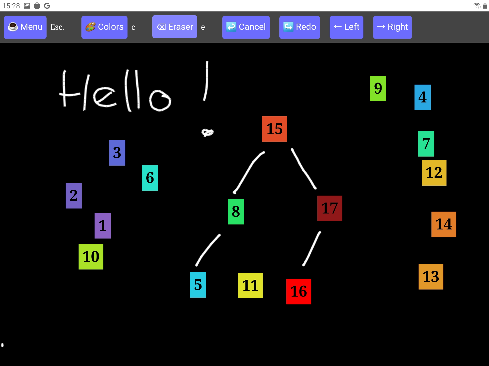

<!--
NOTA: Este README foi creado automáticamente por <https://github.com/YunoHost/apps/tree/master/tools/readme_generator>
NON debe editarse manualmente.
-->

# Tableaunoir para YunoHost

[](https://ci-apps.yunohost.org/ci/apps/tableaunoir/)  

[](https://install-app.yunohost.org/?app=tableaunoir)

*[Le este README en outros idiomas.](./ALL_README.md)*

> *Este paquete permíteche instalar Tableaunoir de xeito rápido e doado nun servidor YunoHost.*  
> *Se non usas YunoHost, le a [documentación](https://yunohost.org/install) para saber como instalalo.*

## Vista xeral

Tableaunoir is an online collaborative blackboard tool with fridge magnets available in many languages. "Tableau noir" means blackboard in French. Contrary to plenty of other collaborative boards on the Internet, with Tableaunoir you can create interactive animations via the use of fridge magnets.

### Features

- Of course, you can draw and erase, with your mouse or a graphic tablet. You can draw shapes.
- Collaborate edit the same board at the same time (need a server for that), does not require an account
- Backgrounds: staffs for teaching music, grid, images and PDF documents
- You can also use kind of predefined fridge magnets that you can move on the board, to make animation e.g. for illustrating sorting algorithms, graphs algorithms etc (and even playing Go!).
- Create your own fridge magnets for interactive courses, by importing any image, or by transforming a part of the board (Ctrl + X).
- Color palette for chalk (c, 7 colors black/white #000000, yellow #FFFF00, orange #FFA500, blue #64ACFF, red #DC143C, pink #DDA0DD, green #32CD32),
- Draw interative graphs : vertices are magnets, labels of vertices and edges are handwritten but are updated when vertices are moved,
- Change the color of magnets' background,
- Load/Save the current board,
- Export in PNG or PDF,
- Add texts (Enter and type), and move texts. Supports LaTeX (using MathJax)!
- Switch to a whiteboard instead of a blackboard, or any background color
- Change from right-handed (default) to left-handed cursor,
- Divide yourboard in half. Ideal for teaching. Add as many new half-board as you need, going right with → and then left/right with ←/→ keyboard arrows,
- Make slides, record animations. This can be used to prepare slides for a talk or for a video.


**Versión proporcionada:** 0.1~ynh1

**Demo:** <https://tableaunoir.github.io/>

## Capturas de pantalla



## Documentación e recursos

- Web oficial da app: <https://tableaunoir.github.io/>
- Repositorio de orixe do código: <https://github.com/tableaunoir/tableaunoir>
- Tenda YunoHost: <https://apps.yunohost.org/app/tableaunoir>
- Informar dun problema: <https://github.com/YunoHost-Apps/tableaunoir_ynh/issues>

## Info de desenvolvemento

Envía a túa colaboración á [rama `testing`](https://github.com/YunoHost-Apps/tableaunoir_ynh/tree/testing).

Para probar a rama `testing`, procede deste xeito:

```bash
sudo yunohost app install https://github.com/YunoHost-Apps/tableaunoir_ynh/tree/testing --debug
ou
sudo yunohost app upgrade tableaunoir -u https://github.com/YunoHost-Apps/tableaunoir_ynh/tree/testing --debug
```

**Máis info sobre o empaquetado da app:** <https://yunohost.org/packaging_apps>
