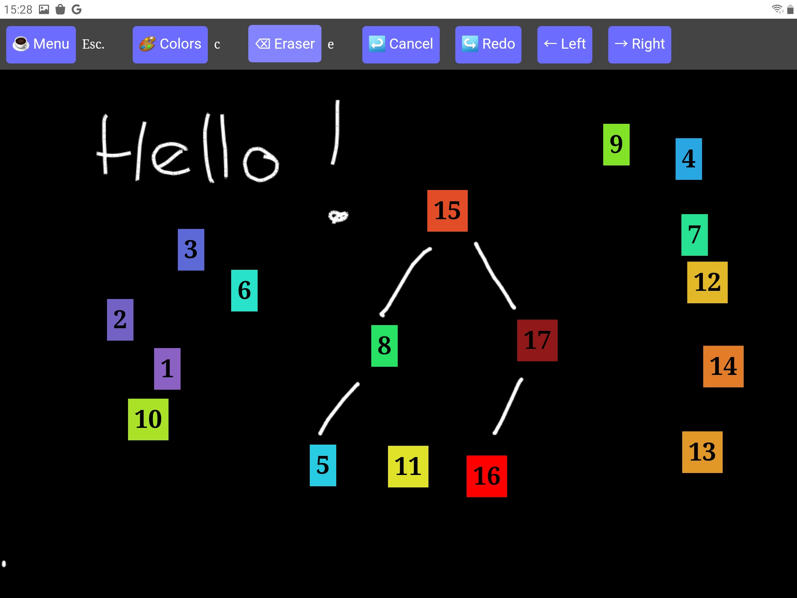

<!--
N.B.: README ini dibuat secara otomatis oleh <https://github.com/YunoHost/apps/tree/master/tools/readme_generator>
Ini TIDAK boleh diedit dengan tangan.
-->

# Tableaunoir untuk YunoHost

[](https://ci-apps.yunohost.org/ci/apps/tableaunoir/)


[](https://install-app.yunohost.org/?app=tableaunoir)

*[Baca README ini dengan bahasa yang lain.](./ALL_README.md)*

> *Paket ini memperbolehkan Anda untuk memasang Tableaunoir secara cepat dan mudah pada server YunoHost.*  
> *Bila Anda tidak mempunyai YunoHost, silakan berkonsultasi dengan [panduan](https://yunohost.org/install) untuk mempelajari bagaimana untuk memasangnya.*

## Ringkasan

Tableaunoir is an online collaborative blackboard tool with fridge magnets available in many languages. "Tableau noir" means blackboard in French. Contrary to plenty of other collaborative boards on the Internet, with Tableaunoir you can create interactive animations via the use of fridge magnets.

### Features

- Of course, you can draw and erase, with your mouse or a graphic tablet. You can draw shapes.
- Collaborate edit the same board at the same time (need a server for that), does not require an account
- Backgrounds: staffs for teaching music, grid, images and PDF documents
- You can also use kind of predefined fridge magnets that you can move on the board, to make animation e.g. for illustrating sorting algorithms, graphs algorithms etc (and even playing Go!).
- Create your own fridge magnets for interactive courses, by importing any image, or by transforming a part of the board (Ctrl + X).
- Color palette for chalk (c, 7 colors black/white #000000, yellow #FFFF00, orange #FFA500, blue #64ACFF, red #DC143C, pink #DDA0DD, green #32CD32),
- Draw interative graphs : vertices are magnets, labels of vertices and edges are handwritten but are updated when vertices are moved,
- Change the color of magnets' background,
- Load/Save the current board,
- Export in PNG or PDF,
- Add texts (Enter and type), and move texts. Supports LaTeX (using MathJax)!
- Switch to a whiteboard instead of a blackboard, or any background color
- Change from right-handed (default) to left-handed cursor,
- Divide yourboard in half. Ideal for teaching. Add as many new half-board as you need, going right with → and then left/right with ←/→ keyboard arrows,
- Make slides, record animations. This can be used to prepare slides for a talk or for a video.


**Versi terkirim:** 0.1~ynh1

**Demo:** <https://tableaunoir.github.io/>

## Tangkapan Layar



## Dokumentasi dan sumber daya

- Website aplikasi resmi: <https://tableaunoir.github.io/>
- Depot kode aplikasi hulu: <https://github.com/tableaunoir/tableaunoir>
- Gudang YunoHost: <https://apps.yunohost.org/app/tableaunoir>
- Laporkan bug: <https://github.com/YunoHost-Apps/tableaunoir_ynh/issues>

## Info developer

Silakan kirim pull request ke [`testing` branch](https://github.com/YunoHost-Apps/tableaunoir_ynh/tree/testing).

Untuk mencoba branch `testing`, silakan dilanjutkan seperti:

```bash
sudo yunohost app install https://github.com/YunoHost-Apps/tableaunoir_ynh/tree/testing --debug
atau
sudo yunohost app upgrade tableaunoir -u https://github.com/YunoHost-Apps/tableaunoir_ynh/tree/testing --debug
```

**Info lebih lanjut mengenai pemaketan aplikasi:** <https://yunohost.org/packaging_apps>
